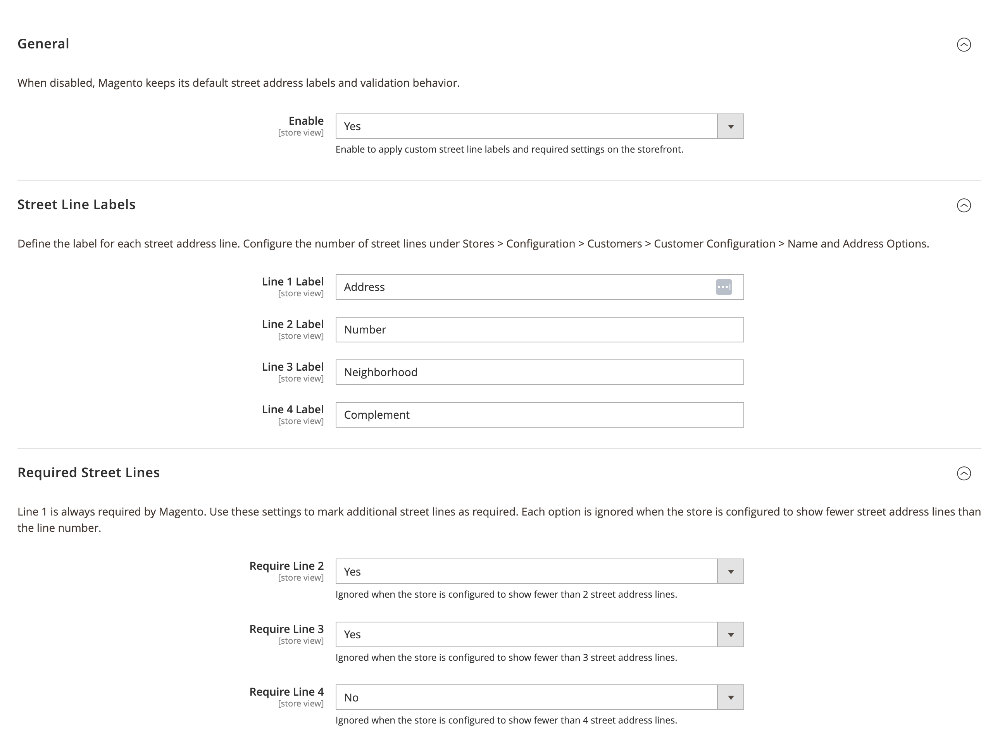
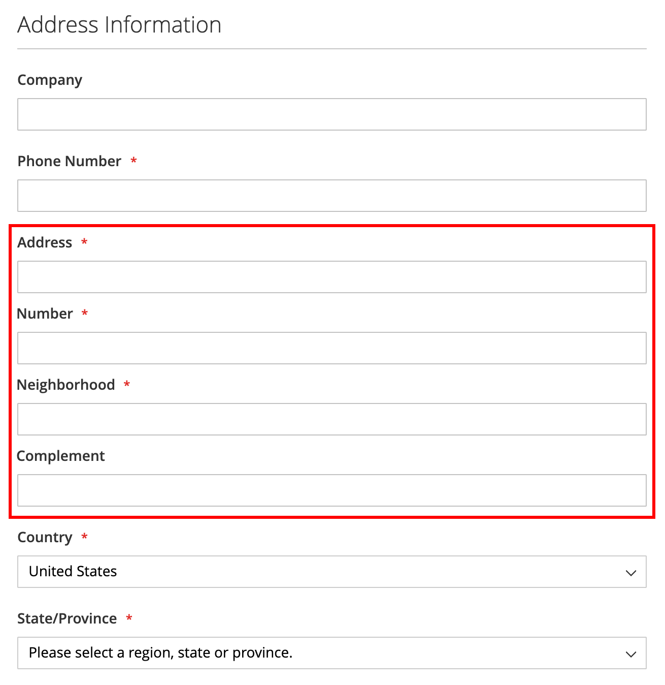
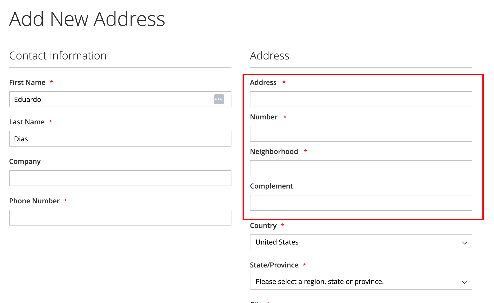
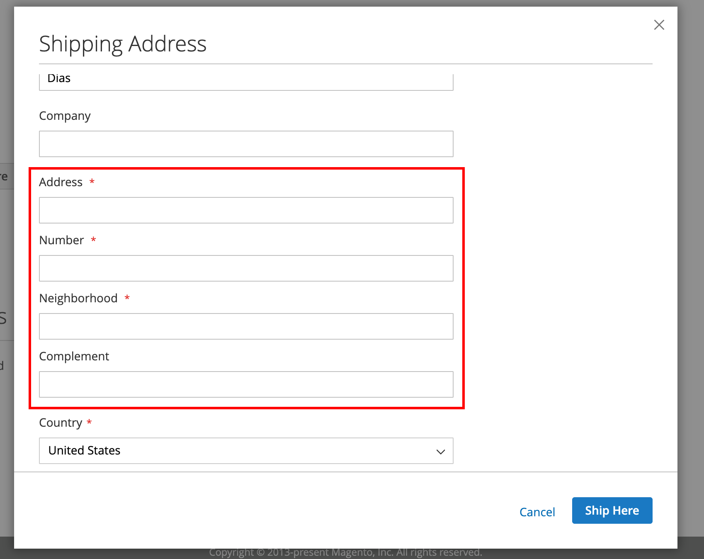

# System Code Street Lines

## About Module

Customizes Magento street address lines with configurable labels and per-line required rules on registration, account edit, and checkout. Useful for Brazilian address formats such as street, number, complement, and neighborhood.

Configure the number of street lines under **Stores > Configuration > Customers > Customer Configuration > Name and Address Options**.

### Configuration

**Stores > Configuration > System Code > Street Lines**

### Screenshots

#### Admin Configuration


#### Customer Registration


#### My Account — Address Book


#### Checkout


### Requirements

- `systemcode/base`
- `systemcode/customer`

### How to install

#### ✓ Install by Composer (recommended)
```
composer require systemcode/base systemcode/customer systemcode/customer-street-lines
php bin/magento module:enable SystemCode_CustomerStreetLines
php bin/magento setup:upgrade
```

#### ✓ Install Manually
- Copy module to folder `app/code/SystemCode/CustomerStreetLines` and run commands:
```
php bin/magento module:enable SystemCode_CustomerStreetLines
php bin/magento setup:di:compile
php bin/magento setup:upgrade
```

### License
OSL-3.0

### Authors
* [Eduardo Diogo Dias](https://github.com/eduardoddias)


---


## Sobre o Módulo

Personaliza as linhas de endereço do Magento com rótulos configuráveis e regras de obrigatoriedade por linha no cadastro, edição de conta e checkout. Útil para formatos brasileiros como logradouro, número, complemento e bairro.

Configure a quantidade de linhas de endereço em **Lojas > Configuração > Clientes > Configuração de Cliente > Opções de Nome e Endereço**.

### Configuração

**Lojas > Configuração > System Code > Street Lines**

### Screenshots

#### Configuração no Admin


#### Cadastro de Cliente


#### Minha Conta — Catálogo de Endereços


#### Checkout


### Requisitos

- `systemcode/base`
- `systemcode/customer`

### Como Instalar

#### ✓ Instalação via Composer (recomendado)
```
composer require systemcode/base systemcode/customer systemcode/customer-street-lines
php bin/magento module:enable SystemCode_CustomerStreetLines
php bin/magento setup:upgrade
```

#### ✓ Instalação Manual
- Copie o módulo para `app/code/SystemCode/CustomerStreetLines` e execute:
```
php bin/magento module:enable SystemCode_CustomerStreetLines
php bin/magento setup:di:compile
php bin/magento setup:upgrade
```

### Licença
OSL-3.0

### Autores
* [Eduardo Diogo Dias](https://github.com/eduardoddias)
